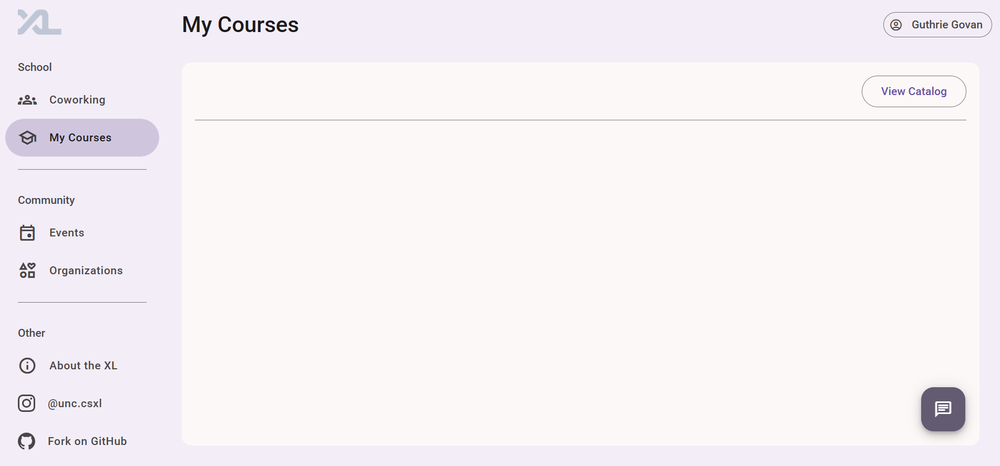
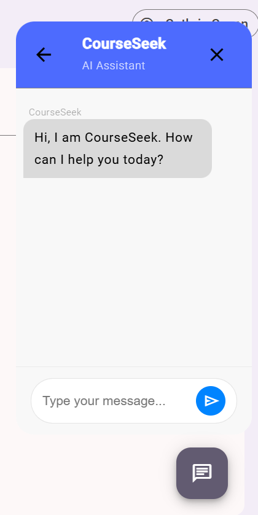
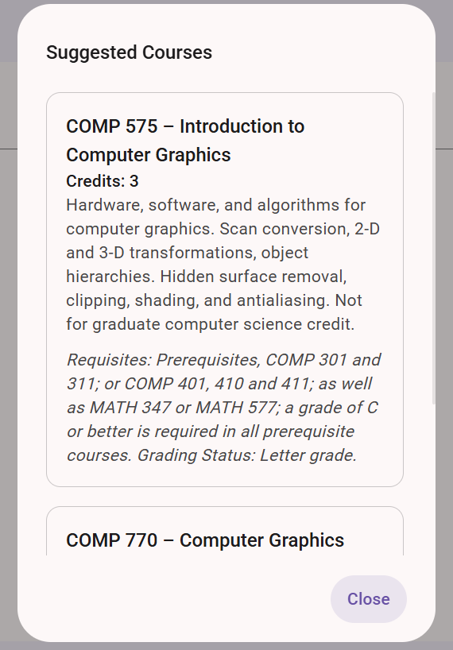

**Authors:**

- Daniel Henderson ([https://github.com/HendersonDaniel](https://github.com/HendersonDaniel))
- Maxim Chadaev ([https://github.com/maximdolphin](https://github.com/maximdolphin))
- Max Yu ([https://github.com/myu123](https://github.com/myu123))
- Peter (Nate) Hicks ([https://github.com/hicksnat](https://github.com/hicksnat))

---

## Overview

CourseSeek is a chatbot feature for the CSXL website that allows users to describe what kind of Computer Science courses they would like to take and the topics that they are interested in and receive advice about what COMP courses in the UNC catalog fit that description. This was built with the intention to help computer science students in getting the most out of their time at UNC Chapel Hill by assisting them in finding courses that appeal to their interests and provide practical value to them personally.

## Frontend

### UI Screenshots:

_Figure 1: Unopened chat button in the corner of the My Courses page_



_Figure 2: A new chat with CourseSeek_



_Figure 3: The course cards that CourseSeek provides as an easily digestible way to present classes_



### Component Structure

All course seek frontend code can be found within `frontend/src/app/my-courses`. The main frontend component made for course seek can be found in `frontend/src/app/my-courses/course-seek`. The dialog component for the course cards (shown in **Figure 3**) can be found in `frontend/src/app/my-courses/dialogs/show-courseseek-cards`. The widgets for it can be found in `frontend/src/app/my-courses/widgets`. The widgets used are the following:

- `chat-bubble` — handles user and AI message display (see **Figure 2**)
- `ai-course-card` — a widget used to display a course as a card in the `show-courseseek-cards` dialog (see **Figure 3**)

The course seek component is shown in the my-courses page in `frontend/src/app/my-courses/my-courses-page` when the open chatbot button is pressed. 

---

## Backend Architecture

For the brains of CourseSeek, OpenAPI is used and accessed through [SemanticKernel](https://learn.microsoft.com/en-us/semantic-kernel/overview/). SemanticKernal is a lightweight open-source development kit that allows for some pretty cool features like AI function calling and has useful pre-built componenents. 

- SemanticKernel implementation and prompting is done in `backend/services/semantic_kernel_chat.py`, where a list of Computer Science classes at UNC is fed into an OpenAPI request. SemanticKernel will return these in a format able to be used by CourseSeek to construct Course Cards.
- Routes for initiating a new chat session, retrieving chat history, and retrieving previous chat sessions are defined in `backend/models/semantic_chat_models.py`
- Service for creating sessions can be found at `backend/models/semantic_chat_models.py`

### AI Request Flow Summary

```text
User (frontend)
   │
   ▼
POST /api/academics/semantic-chat
   │
   ▼
semantic_chat.py
   ├─ create_session(db, user.id)
   └─ call to ConversationStateManager.send_message()
         │
         ▼
    Semantic Kernel (SK) generates prompt
         │
         ▼
    OpenAI / Azure OpenAI API
         │
         ▼
    AI returns course recommendations
         │
         ▼
Back to semantic_chat.py → response packaged
   │
   ▼
JSON returned to frontend
   │
   ▼
Rendered in `chat-bubble` component
```

---

## Database Models

CourseSeek uses SQLAlchemy ORM with a PostgreSQL database to persist chat sessions and messages.

### Tables Overview

| Table          | Fields                                                                                     | Description                                       |
| -------------- | ------------------------------------------------------------------------------------------ | ------------------------------------------------- |
| `chat_session` | `id` (UUID), `user_id` (int), `created_at` (datetime)                                      | Stores metadata for each conversation session     |
| `chat_message` | `id` (UUID), `session_id` (UUID), `sender` (str), `content` (text), `timestamp` (datetime) | Stores all messages exchanged between user and AI |

---

### Message Flow

Each message is stored in the `chat_message` table, linked to a `chat_session`. This allows users to:

- Maintain multi-turn conversation history
- Retrieve prior sessions
- Store chat context for AI prompt generation

The `sender` field distinguishes between user and AI messages.

---

### SQLAlchemy Example (chat_session)

```python
class ChatSession(Base):
    __tablename__ = "chat_session"

    id = Column(String, primary_key=True)
    user_id = Column(Integer, nullable=False)
    created_at = Column(DateTime(timezone=True), default=func.now())
```
